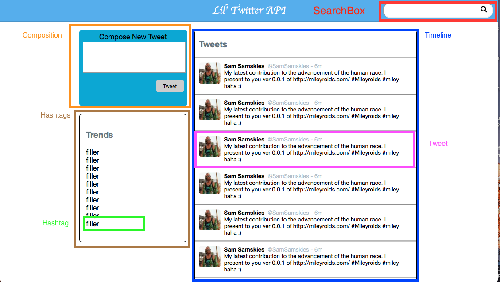

## Lil' Twitter

## Learning Competencies

* Task 1: Install and use a global NPM package: `create-react-app`
* Task 2: Name steps in mockup, static, `React.Component` design strategy
* Task 3: Identify atomic `React.Component`(s) from a mockup and create
* Task 4: Establish centralized, unidirectional data flow for communication between `React.Component` thus "composing" them
* Task 5: Articulate virtues of React based on experience

## Summary

A common application architecture pattern of 2017 is the "non-monolithic application."

It is typical to build a back-end which implements RESTful interfaces and
returns JSON objects. For this Rails is a typical solution as is PHP, Django,
or Java.

By building a "view-ignorant" interface, various clients are able to use the
same system. iPhones and browsers and even Amazon Echos are all able to work
with back-ends of this variety. These objects constitute another application
that we'll call the "client" application.

One option here is to build a React application which consumes the JSON. You
will do this. We will provide you a Rails-based back-end. You will need to
build a React application using `create-react-app`.

## Development Setup

Clone this repo to your local system:

```sh
$ bundle install
$ rake db:create && rake db:migrate && rake db:seed
$ rails server
```

You should see the Rails startup message. Confirm that the `/tweets/recent`
JSON endpoint is active and available

Create a baseline application with `create-react-app`. Start it up with `yarn
start`. When you do so you will see that the React web server will be "in
contention" with the Rails server for port 3000. You can set a `PORT`
environment variable when executing the `yarn start` command **OR** you can
find an option in the `rails --help` screen to find changing _its_ port.
Welcome to the wrinkles of non-monolithic app development!

## Releases

### Release 0: See What's Available

Our client application will be in a new directory created with
`create-react-app`.

We'll be making a single page app, which means we never refresh. All of this
will be accomplished using React framework.

Check the Endpoint Documentation at the bottom of this document to see what
data you can request from the server, then look at the Rails app to examine the
specific controllers and routes that will allow your Javascript code to send
and receive data from the server. You might even hit some of those routes
directly in your browser to see what they return.

This is an excellent chance to practice the behavior that will come when you
seek to consume data from other 3rd party APIs. Your app will be contingent on
what's published, knowing what you can _get_ will bound what you can _do_.

### Release 1: Contextualize Work Into  the Mockup / Static / Static React Component Strategy

You should have practice at _seeing_ small components of screen real estate.
Some people call them "Widgets" others call them "Components." React calls them
`Components`, so we'll stick with that name, but it means the same thing.

In this challenge, the mockup has been provided to you and we've provided
suggested `Component` names e.g. `Tweet` or `Compose`. `Component`s are usually
named _noun_. So it's `Composition` (component) versus `Compose` (component).
We've also provided a static HTML / CSS version in the Rails `static/index`
view to help speed you along.



Consequently the work of this challenge is to extract the HTML into
`Component`s.  You should re-implement this page in a React application with
**no** behavior and **with** hard-coded state.

**TIP**: Don not over-componentize your app. It's better to have larger
components that can be refactored later rather than consolidating a bunch of
smaller components.

### Release 2: Work out data sharing between `Timeline` and `Tweet`s

Get a sample of data from the `/tweets/recent` endpoint. It's possible to
request only a certain number of responses (check the code!). Store this
information in the `Timeline` `Component` and cascade the information down to
the independent `Tweet` Components. The goal is to have `Timeline` own
some data that it feeds to each of its child `Tweet`s.

It should be noticable that we're **NOT** working on Ajax calls here. Because
network calls take time and we're trying to develop quickly, we're going to
"stub" the data in until we get the components working. Once we get the
`Component`s right and the data cascade right adding AJAX is no big deal. So
the move here is from hard-coded stub data to stubbed data _that is actually in
the back-end system_.

You're going to be iterating over a collection of tweets as JSON, so you might
want to keep the reference for iteration in JSX handy.  This topic is
well-covered in the React documentation so practice your React doc reading
skills: [Embedding `map` in JSX][map]. By most professional measures React's
documentation is top-notch.

Be sure to notice the behavior around the "key" property: [Keys in React][keys]

### Release 3: Provide Fetched Data to the Timeline

When React components are rendered into the DOM they are said to be "mounting."

Every subclass of `React.Component` will have its "lifecycle methods" run,
provided that they are defined. The two most important are:
`componentDidMount()` and ` componentWillUnmount()` which correspond to the
initial injection into the DOM and shutdown, respectively. It's sort of like
the `document.ready()` for the `Component`.

When a component needs to manage some data for itself or for its child
Components, it's appropriate for the data retrieval to happen in the
`componentDidMount` method. For more see: [React State and Lifecycle Methods][ReactLC].

Fetch data from the Rails application so that you can populate your
`Timeline`.

Feel free to use `$.ajax` (you'll need to install jQuery into the
`create-react-app` environment). Alternatively, you could take a try
at [using the new `fetch()` API of ES6][fetch-intro]. It's designed to be a replacement
for `$.ajax` and is becoming The New Standard Thing.

Based on your pair's momentum, decide which implementation best suits you.

When you perform your asynchronous call to the Rails server, you're going to
get an error about CORS. You **should hit this error**. We have left it in
place for you to learn something important.

#### Expected Errors

[CORS means "Cross Origin Resource Sharing."][cors] it's designed to be a
safety measure against certain types of attacks on servers that are perpetrated
by malicious individuals called "Denial of Service" (DoS) attacks.

Imagine a web server that accepts API requests from all individuals across the
world.  Imagine a malicious person had control over thousands of computers (a
"botnet") and knew of an API request that was complicated or "expensive" to
calculate. By having an army of these machines all constantly requesting that
same expensive calculation be done, the attacker could "bog down" the web
server or database or both such that the web site would stop responding thus
"taking it off the air" or "Denying the service."

As a guard against these types of attacks, Rails ships with a protection that
will only let AJAX requests from the same source query it. So JavaScript served
at `http://localhost:3000` can ask `http://localhost:3000` for some async data,
but JavaScript served from `http://localhost:8000` (say your React app created
by `create-react-app`), by default, **cannot** make that same query. We have to
tell Rails to let the wide world make API requests. Implicitly we're saying
that we realize DoS attacks are possible when we change this default
configuration to a more permissive state.

In the Rails app's `config/application.rb` file add the following `config`
directive after the `config.assets.version` line:

    # Disable CORS for React App
    config.action_dispatch.default_headers = {
      'Access-Control-Allow-Origin' => '*',
      'Access-Control-Request-Method' => %w{GET POST OPTIONS}.join(",")
    }

Here we're saying allow requests from any location (`*`) of the 3 HTTP verb
types `GET`, `POST`, and `OPTIONS`.

You'll need to stop and restart your Rails server for this change to take
effect.


### Release 4: Update the Back-End

Add Components to manage a form. Managing state here gets a little bit
complicated but the [React Docs][] document the matter explicitly in the
section on [forms](https://facebook.github.io/react/docs/forms.html).

#### Another Protection: CSRF: Cross-Site Request Forgery

[Read the Reddit Explain Like I'm 5 post about CSRF][eli5].

In order to protect Rails from  CSRF , Rails, with each `<form>` adds a little
secret (called a `nonce` in the Reddit article) which say "Hey form, when you
come back in, to prove that I was the one that wrote you, tell me this one-time
password I just told you." The "nonce" is stored in a hidden field called
`authenticity_token`.

		 <form class="new_tweet" id="new_tweet" action="/tweets" accept-charset="UTF-8" method="post"><input name="utf8" type="hidden" value="&#x2713;" /><input type="hidden" name="authenticity_token" value="XaBzSK0RYBthutdDGZN1ug2j17kUEmSJ9b8HJg7OQB12MBJVt/QYeUmJX7vRHRqKSpFGLJqh9SpnkdugkE9HQQ==" />
				<h1>hi</h1>
				<input type="text" name="tweet[username]" id="tweet_username" />
				<input type="submit" name="commit" value="Create Tweet" />
		</form>

Here Rails, when `POST`ing the new `Tweet` says, "Hey to prove that I was the
one to whom you gave you this update URL, here's the secret password:
`XaBzSK0RYBthutdDGZN1ug2j17kUEmSJ9b8HJg7OQB12MBJVt`."

Now if you're building a form in another React application, you obviously don't
have the seret token. Consequently if you update, you won't pass the CSRF
protection. For purposes of this exercise, we will remove that protection.

From `app/controllers/application_controller.rb`, remove the line
`protect_from_forgery`. Save the file.

You'll need to stop and restart your Rails server for this change to take
effect.

### Release 5: Repeat

With the `Timeline` and the `TweetBox` views in place, you've had the chance to
prove that you know the basic competencies behind this challenge. The process
will remain the same for other data you fetch from the application. If time
allows, move on to creating other components, stubbing their data in, and then
fetching the data live. We'll call the work of the release up til now the "MVP"
or "Milestone 1." It's the demonstration that you understand the "theory"
behind the application.

A fully realized implementation might proceed like the following.

#### Milestone 2

> - On page load, the 50 most recent tweets are displayed in the 'river' running down the middle of the page.
> - On page load, the 10 most popular hashtags are displayed.

#### Milestone 3

> - A user can create a tweet, which will get saved into the database with a fake username, fake handle, and fake avatar (which is all handled server-side).
> - The new tweet should appear atop the 'river', preferrably with some sort of animation.
> - Any hashtags the tweet includes (e.g. #yolo), should also be associated with that tweet.

#### Milestone 4
> - A user can search for a specific hashtag using the search bar. The results of the search will be displayed in the river, replacing whatever was there before.
> - If the user searches for a hashtag that does not exist, the search bar turns red.


#### Milestone 5
> - A user can click on a hashtag in the trends box, which causes the river to display all tweets that are associated with that hashtag, replacing whatever was there before.


### Endpoint Documentation

`GET /tweets/recent` returns the 50 most recently created tweets in JSON format. The response body looks like this:

  ```json
[
   {
      "avatar_url":"http://robohash.org/marco_schumm",
      "content":"Ut fugit ut labore repellendus.",
      "created_at":"2014-07-20T20:27:42Z",
      "handle":"@marco_schumm",
      "id":500,
      "updated_at":"2014-07-20T20:27:42Z",
      "username":"Adaline Bins",
      "hashtag_names":[
         "est",
         "rerum",
         "distinctio"
      ]
   }
]
  ```

`GET /tweets/search/:hashtag` returns the 50 most recent tweets associated with the given hashtag, with a format similar to the `/recent` endpoint. Will return an empty body with a status code of 404 if the hastag does not exist.

`POST /tweets` creates a new a tweet and associates it with the specified hashtags, if provided. Hashtags that did not previously exist are also created. a request body should take this format:

```json
{
   "tweet":{
      "avatar_url":"http://robohash.org/marco_schumm",
      "content":"Ut fugit ut labore repellendus.",
      "handle":"@marco_schumm",
      "username":"Adaline Bins"
   },
   "hashtags":[
      "foo",
      "bar",
      "baz"
   ]
}
```

If no data is provided for avatar_url, content, handle, or username, fake data is used instead.

The endpoint returns the created tweet as JSON.

  ```json
{
   "avatar_url":"http://robohash.org/Margot Morar II",
   "content":"This is my new tweet",
   "created_at":"2015-07-10T22:18:20Z",
   "handle":"@royal",
   "id":503,
   "updated_at":"2015-07-10T22:18:20Z",
   "username":"Margot Morar II",
   "hashtag_names":[
      "foo",
      "bar",
      "baz"
   ]
}
  ```

`GET /hashtags/popular` returns the names of the 10 most popular hashtags. The output looks like this:

```json
[
   {
      "hashtag_count":"39",
      "name":"labore"
   },
   {
      "hashtag_count":"35",
      "name":"ratione"
   },
   {
      "hashtag_count":"35",
      "name":"architecto"
   },
   {
      "hashtag_count":"33",
      "name":"vero"
   },
   {
      "hashtag_count":"32",
      "name":"ut"
   }
]
```

### Stretch

This is a beefy challenge, but to really test your grasp of JavaScript and
React consider adding any or all features to your application:

 - Add a system for checking if new tweets have been created since page load, using long-polling.
 - Have the river of tweets only display 10 tweets, and dynamically load more when the user scrolls to the bottom of the page.
 - Give the user the ability to click hashtags inside tweets, which would display tweets associated with that hashtag.

### Conclusion

This is a tough challenge! It's big and broad and exactly the sort of thing
thaat would open doors in a coding portfolio! Make it yours or be inspired by
it to do your own version!

[React Docs]: https://facebook.github.io/react/docs/hello-world.html
[map]: https://facebook.github.io/react/docs/lists-and-keys.html#embedding-map-in-jsx
[keys]: https://facebook.github.io/react/docs/lists-and-keys.html#keys
[ReactLC]: https://facebook.github.io/react/docs/component-specs.html
[fetch-intro]: https://dev.to/jspeda/using-fetch-and-reduce-to-grab-and-format-data-from-an-external-api---a-practical-guide
[cors]: https://developer.mozilla.org/en-US/docs/Web/HTTP/Access_control_CORS
[eli5]: https://www.reddit.com/r/explainlikeimfive/comments/wayk3/eli5_cross_site_request_forgery_csrf/

